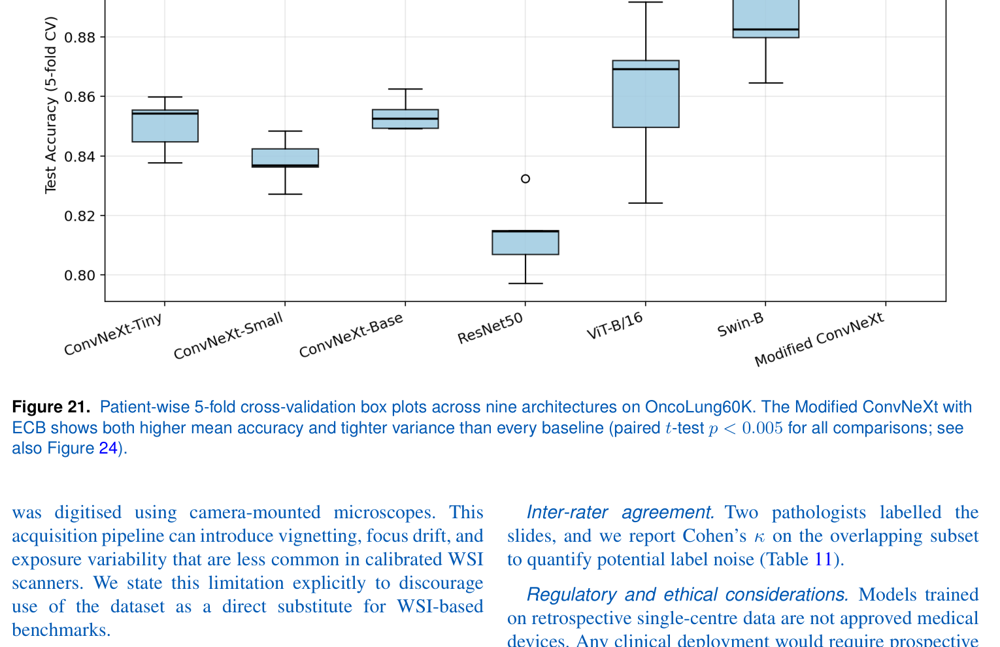

# Patient-Wise Cross-Validation Splits

This directory contains the CSV files used for patient-wise stratified 5-fold cross-validation in the paper *"Leveraging the Modified ConvNeXt Model and OncoLung60K Dataset for Lung Cancer Diagnosis"*. Use these to reproduce the patient-to-fold assignment used in all reported experiments.

---

## Method at a glance

The proposed Modified ConvNeXt replaces every block of the four-stage ConvNeXt backbone with an Enhanced ConvNeXt Block (ECB) that adds a multi-scale pooling and contrast-aware fusion path on top of the depthwise-convolution stream.

![Overall Modified ConvNeXt architecture]
*Overall architecture of the Modified ConvNeXt. The four hierarchical stages (S1–S4) progressively halve spatial resolution while doubling channel dimensionality; each stage replaces the standard ConvNeXt block with the Enhanced ConvNeXt Block (ECB).*

![ECB vs. baseline block]
*Side-by-side comparison of the baseline ConvNeXt block (left) and the Enhanced ConvNeXt Block (right). The ECB augments the depthwise-convolution path with parallel max/average pooling, an explicit max − average contrast map, and channel-wise fusion via a 1 × 1 convolution before re-injection into the residual stream.*

For full architectural detail (pooling stride, fusion 1×1, residual paths) see Figure 3 of the paper.

---

## Headline result

Patient-wise stratified 5-fold CV on OncoLung60K, with eight modern baselines (CNN, transformer, hybrid):

![Accuracy vs. model size]
*Modified ConvNeXt (red star) achieves the highest mean accuracy across all tested architecture families. Error bars are ±1 std across the 5 patient-wise folds; marker size is proportional to GFLOPs at 256×256 input.*

---

## Files in this directory

| File | Rows | Patients | Classes |
|------|------|----------|---------|
| `oncolung60k_image_folds.csv` | 60,000 | 65 | 4 (Adeno, SCC, SCLC, NC) |
| `oncolung60k_patient_folds.csv` | 65 | 65 | 4 |
| `lunghist700_5fold.csv` *(planned)* | 691 | 45 | 7 (3 ACA + 3 SCC + Normal) |

The 65 patients are distributed across classes as follows: **Adeno 16, SCC 21, SCLC 12, NC 16**. NC (Normal Control) is the class folder name in the released dataset; throughout the paper this class is referred to as *Normal*.

![Patient demographics]
*OncoLung60K patient demographics: (a) age distribution (mean 61.2 years, n = 65), (b) sex distribution (65 % male / 35 % female), (c) class distribution per patient (Adeno 16, SCC 21, SCLC 12, Normal 16).*

---

## CSV schemas

### `oncolung60k_image_folds.csv` — one row per image

```
filepath,label,patient_id,fold
train/Adeno/105_46190.jpg,Adeno,1,1
train/Adeno/105_46198.jpg,Adeno,1,1
val/SCC/13_1234.jpg,SCC,17,0
test/NC/12_4567.jpg,NC,55,2
```

- **filepath** — path relative to the OncoLung60K dataset root (the directory you extracted from Zenodo).
- **label** — class name as a string: `Adeno`, `SCC`, `SCLC`, or `NC`.
- **patient_id** — integer in 1..65; unique per patient and constant across all of a patient's images.
- **fold** — integer in 0..4; the fold that this patient (and therefore this image) belongs to.

### `oncolung60k_patient_folds.csv` — one row per patient

```
patient_id,label,n_tiles,fold
1,Adeno,4661,1
2,Adeno,4491,2
...
65,NC,696,4
```

Useful for sanity-checking per-patient image counts.

---

## Per-fold composition (actual, not idealised)

Patient-wise CV with whole-slide groups produces uneven folds because individual slides vary enormously in tile count (one SCLC slide alone contributes 9,389 patches). This is intrinsic to the data, not a bug in the split.

| Fold | Patients | Total tiles | Adeno | SCC | SCLC | NC |
|------|----------|-------------|-------|-----|------|----|
| 0    | 17       | 16,303      | 1,542 | 2,447 | 9,389 | 2,925 |
| 1    | 15       | 11,794      | 4,661 | 2,439 | 1,409 | 3,285 |
| 2    | 14       | 11,339      | 4,491 | 2,427 | 1,451 | 2,970 |
| 3    | 12       | 9,658       | 1,572 | 3,851 | 1,333 | 2,902 |
| 4    | 7        | 10,906      | 2,734 | 3,836 | 1,418 | 2,918 |

The reported `91.4 ± 0.9 %` accuracy is the mean and standard deviation across these folds — the fold variance is already baked into the result.


*Per-fold accuracy box-plots across nine architectures on OncoLung60K. The Modified ConvNeXt shows both higher mean accuracy and tighter variance than every baseline.*

---

## Verifying no patient leakage

```bash
python scripts/verify_no_leakage.py --csv splits/oncolung60k_image_folds.csv
```

Expected output:

```
Loaded 60000 rows from splits/oncolung60k_image_folds.csv
Patients: 65
Folds:    [0, 1, 2, 3, 4]

--- Per-fold summary ---
 fold  n_patches  n_patients  Adeno   SCC  SCLC    NC
    0      16303          17   1542  2447  9389  2925
    1      11794          15   4661  2439  1409  3285
    2      11339          14   4491  2427  1451  2970
    3       9658          12   1572  3851  1333  2902
    4      10906           7   2734  3836  1418  2918

--- Patient leakage check ---
OK: No patient_id appears in more than one fold
OK: No (label, slide_id) appears in more than one fold
```

---

## Per-class clinical metrics (with these splits)

![Per-class sensitivity / specificity / PPV / NPV]
*Per-class Sensitivity, Specificity, PPV and NPV on OncoLung60K (Modified ConvNeXt under patient-wise 5-fold CV). Sensitivity exceeds 0.90 and specificity exceeds 0.96 for every class.*

![ROC and Precision–Recall curves]
*Aggregated ROC (one-vs-rest) and Precision–Recall curves. All four classes exceed AUC 0.96 and average precision 0.93.*

---

## Explainability sanity check

![Grad-CAM++ heatmaps]
*Grad-CAM++ visualisations on representative test patches. Heatmaps consistently localise diagnostically relevant cellular regions (nuclear clusters and glandular boundaries in Adeno, keratin pearls in SCC, dense small-cell regions in SCLC). Mean IoU against pathologist-annotated regions on a 200-patch subset: 0.71 ± 0.08.*

---

## Regenerating splits

If you want to regenerate splits with a different seed:

```bash
python -m src.utils.splits \
    --metadata splits/oncolung60k_master.csv \
    --output   splits/oncolung60k_image_folds_seed99.csv \
    --n_splits 5 \
    --seed     99
```

⚠️ **For paper reproduction, use the provided CSVs.** Re-generating with a different seed produces different folds and slightly different accuracy numbers.

---

## Generation procedure

The splits were generated as follows:

1. Patients were defined by grouping the 75 original `(class, slide_id)` slides into 65 patients via Longest-Processing-Time greedy bin packing within each class, with target patient counts of 16 / 21 / 12 / 16 for Adeno / SCC / SCLC / NC. Every patient owns at least one whole slide; slides are never split across patients.
2. Fold assignment was performed by `sklearn.model_selection.StratifiedGroupKFold(n_splits=5, shuffle=True, random_state=42)` with `patient_id` as the group and `label` as the stratification variable.
3. This guarantees zero patient (and therefore zero slide) overlap between folds.

The generation script is at `scripts/build_splits.py`. Running it from a fresh checkout produces these CSVs byte-for-byte.

---

## Patient identifiers

`patient_id` values are integers (1..65) used only for grouping during cross-validation. They are not linked to clinical records and contain no identifying information.

<!--
EDIT BEFORE PUBLISHING:
If you have a real IRB / ethics approval number for the OncoLung60K cohort,
replace this comment block with a single sentence such as:

    Slide collection and annotation were conducted under
    approval NUMS-IRB-2023-021 from the National University of Medical
    Sciences, Pakistan.

If no such IRB approval exists, delete this comment block entirely. The
repository's main README must also be kept consistent: do not claim an
IRB number anywhere unless it is real and is also stated in the
manuscript.
-->

---

## Citation

If you use these splits or the OncoLung60K dataset, please cite the paper. BibTeX entry will be added on publication.

```bibtex
@article{ahmad2026modifiedconvnext,
  title   = {Leveraging the Modified ConvNeXt Model and OncoLung60K Dataset for Lung Cancer Diagnosis},
  author  = {Ahmad, Mansoor and Raja, Gulistan},
  journal = {Journal of Intelligent \& Fuzzy Systems},
  year    = {2026},
  note    = {In press}
}
```
